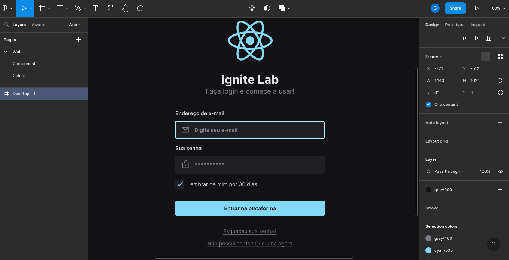
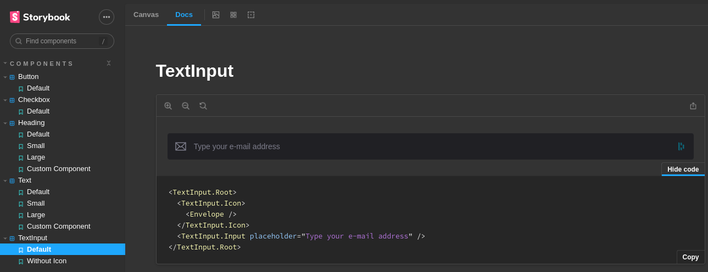

# Ignite Lab Design System

> This is a project made with Rocketseat englobing Storybook, Figma, React, Tailwind.

With this project, I learned how to make simple designs on Figma, port them to React with Tailwind tokens, document them on storybook and to deploy this doc on Github Pages.

<br />





<br />

## Develop

To develop is simple:

```sh
yarn # To install all the dependencies.
yarn dev # To run the Vite server.
yarn storybook # If you want to run Storybook.
```
